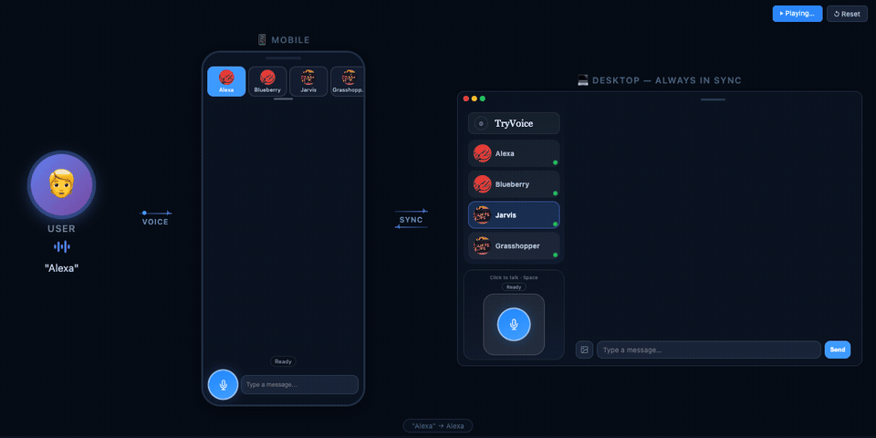

# TryVoice

Hands-free voice runtime for AI agents. Talk to your AI coding assistant without touching the keyboard.

TryVoice wraps AI agents (like [OpenClaw](https://github.com/anthropics/openclaw) and [Claude Code](https://docs.anthropic.com/en/docs/claude-code)) into a voice interface with wake word activation, push-to-talk, and real-time streaming — all running in your browser.

> **Early Preview (v0.1.0-alpha)** — actively developed, expect rough edges.

<p align="center">
  
</p>

## What It Does

- **Wake word activation** — say a keyword to start talking, no hands needed (powered by [OpenWakeWord](https://github.com/dscripka/openWakeWord))
- **Push-to-talk** — hold a button to speak, release to send
- **Real-time streaming** — hear the AI respond as it generates, with interruptible playback
- **Multi-bot slots** — run multiple independent agent sessions side by side
- **Mobile-ready** — PWA support, works on phone browsers
- **Pluggable adapters** — connect any AI agent via the Adapter SDK

## Prerequisites

TryVoice is a **voice layer on top of existing AI agents**. You need at least one of:

- **[Claude Code](https://docs.anthropic.com/en/docs/claude-code)** — installed on the same machine (`claude` CLI available in PATH)
- **[OpenClaw](https://github.com/anthropics/openclaw)** — running with a gateway endpoint

> More agent adapters coming soon. See [Building an Adapter](#building-an-adapter) to connect your own agent.

## Quick Start

### Option A: Install from PyPI (recommended)

```bash
pip install tryvoice
tryvoice            # Start the server and open browser
# First launch shows Setup Wizard in browser — configure adapter, TTS, etc.

# If "command not found", try:
python3 -m backend.cli
```

### Option B: Install from source

```bash
git clone https://github.com/AaronZ021/tryvoice-oss.git
cd tryvoice
bash scripts/setup.sh   # Creates venv, installs packages, builds frontend
source .venv/bin/activate
tryvoice                 # Start the server and open browser
# First launch shows Setup Wizard in browser
```

### Configure

On first launch, the browser opens a **Setup Wizard** that walks you through:

1. **API Keys (optional but recommended)** — enter a [Groq API key](https://console.groq.com/) for faster speech-to-text (lower latency than local Whisper), and an [Azure Speech key](https://azure.microsoft.com/en-us/products/ai-services/speech-to-text) for high-quality text-to-speech
2. **Adapter** — choose Claude Code or OpenClaw and enter connection details
3. **Wake word** — pick a keyword (e.g., "jarvis", "americano") for hands-free voice activation

All settings can be changed later from the in-app settings panel.

## Docker

```bash
git clone https://github.com/AaronZ021/tryvoice-oss.git
cd tryvoice
docker compose up
# Open https://localhost:7860 — Setup Wizard runs on first launch
```

## Architecture

```
┌─────────────┐     WebSocket      ┌──────────────────┐
│  Browser UI  │◄──────────────────►│   TryVoice       │
│  (PWA)       │                    │   Runtime         │
│              │                    │                   │
│  Wake Word   │                    │  ┌────────────┐   │
│  STT / TTS   │                    │  │  Adapter    │   │──► Claude Code
│  Audio I/O   │                    │  │  Registry   │   │──► OpenClaw
│              │                    │  │  (plugin)   │   │──► Your adapter
└─────────────┘                    └──┴────────────┴───┘
```

**Voice flow:** Wake word / PTT → STT (browser Web Speech API or Groq Whisper) → Adapter → Agent → Streaming text → TTS (Edge TTS) → Audio playback

## Configuration

| Variable | Default | Description |
|----------|---------|-------------|
| `TRYVOICE_ACTIVE_ADAPTER` | `echo` | Active adapter (`claude-code`, `openclaw`, or custom) |
| `GROQ_API_KEY` | — | Groq API key for server-side STT (optional, browser fallback) |
| `EDGE_TTS_VOICE` | `zh-CN-XiaoxiaoNeural` | Edge TTS voice (300+ voices available) |
| `PORT` | `7860` | Server port |

See [.env.example](.env.example) for all options, or run `tryvoice --setup` for an interactive wizard.

## Built-in Adapters

| Adapter | Use Case |
|---------|----------|
| `claude-code` | Voice control for Claude Code terminal sessions |
| `openclaw` | Voice interface to OpenClaw agent gateway |
| `echo` | Testing and demo (echoes your speech back) |

## Building an Adapter

Connect TryVoice to any AI agent by implementing the Adapter protocol:

```python
from backend.adapter_sdk import AdapterCapabilities, AdapterEvent

class MyAdapter:
    def report_capabilities(self) -> AdapterCapabilities:
        return AdapterCapabilities(supports_stream=True, ...)

    async def stream_user_turn(self, session_key, text, ...):
        # Call your agent, yield AdapterEvent chunks
        yield AdapterEvent(kind="token", text="Hello!")
        yield AdapterEvent(kind="turn_end")
```

Register via entry point in `pyproject.toml`:

```toml
[project.entry-points."tryvoice.adapters"]
my-agent = "my_package.adapter:MyAdapter"
```

## Development

### Prerequisites

- Python 3.9+ (3.11 recommended)
- Node.js 20+ (for frontend build)

### Setup

```bash
git clone https://github.com/AaronZ021/tryvoice-oss.git
cd tryvoice
bash scripts/setup.sh
source .venv/bin/activate
tryvoice
```

### Project structure

```
tryvoice/
├── apps/
│   ├── host-runtime/      # Python FastAPI backend (adapter layer, session FSM, voice providers)
│   └── client-web/        # TypeScript frontend (Vite, state machine, wake word, audio)
├── scripts/               # Setup and build scripts
├── pyproject.toml          # Python package config
├── Dockerfile              # Multi-stage build (Node + Python)
└── docker-compose.yml      # Single-command deployment
```

## License

Apache License 2.0 — see [LICENSE](LICENSE).
